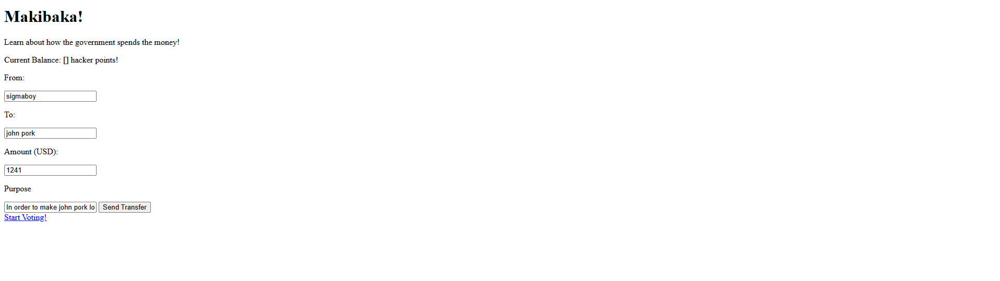

# Makibaka

## Demonstration
https://blockmos.vercel.app/

## Project Aims

### "Corrupt af"

Makibaka is a mini python blockchain project used as a proof-of-concept for a very soon to be government project in the Philippines.

I planned this project as a prototype for future iteration of uses for a blockchain tax collecting system in order for public officials to be able to be transparent about the finances of the country.

## Contents of the Project

In my proposed system, blockchain is used in order to track government transactions. Citizens can audit whether or not this transaction is valid or not. Afterwards, they are rewarded with coins/tokens for contributing to the audit of the transaction.

## How does it work?

### Blockchain Aspect
For every time a transaction of the government is made, it is recorded and noted via this blockchain system.

### Democracy
A feature in which citizens can verify or flag suspicious government spending

### Coin Incentives
Every time a citizen audits data or contributes to verifying a ledger, they earn tokens/coins

### Accessbility
A simplified version of the raw data of blockchain is provided. However, this may only be done with a sufficient UI.

## Project Status
The project is a prototype of a system in order to use blockchain for government transactions. 

## Support

For questions, suggestions, or collaborations, feel free to contact the engineeer:

Niq Suguitan

- Github: @Niqtan

- Slack User: @Niq

- Email: niqban123@gmail.com

Thank you for checking out BlockMos!